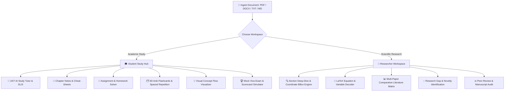

<div align="center">

# 🎓 DocuMind Scholar

### Next-Generation AI Academic Copilot & Research Synthesis Workstation
**Bridging Advanced Scientific Research with Active Recall Academic Learning**

[](https://fastapi.tiangolo.com/)
[](https://reactjs.org/)
[](https://www.typescriptlang.org/)
[](https://tailwindcss.com/)
[](https://www.python.org/)
[](https://katex.org/)
[](https://deepmind.google/technologies/gemini/)
[](https://groq.com/)

<p align="center">
  <a href="#-quick-start">Quick Start</a> •
  <a href="#-dual-workspace-architecture">Workspaces</a> •
  <a href="#-key-features">Key Features</a> •
  <a href="#-technology-stack">Tech Stack</a> •
  <a href="#-api-endpoints">API Docs</a> •
  <a href="#-project-structure">Project Structure</a>
</p>

---

</div>

## 📌 Introduction

**DocuMind Scholar** is a full-stack, enterprise-grade AI academic workstation designed for **Researchers, Postgraduates, and Students**. It eliminates the shallow responses and hallucination issues of generic document chatbots by combining:

1. **Section-Aware Coordinate Parsing** (`Abstract`, `Methods`, `Math`, `Experiments`, `Limitations`) with bounding-box PDF highlights.
2. **KaTeX Mathematical Formula Breakdown** with step-by-step variable dimensions and physical intuitions.
3. **Multi-Paper Literature Synthesis** comparing 2 to 10 papers with direct `.tex` (NeurIPS/IEEE) and `.bib` exporters.
4. **Active Recall Study Studio** featuring 3D Anki-style flip cards, interactive pipeline flowcharts, and mock viva exams.

---

## 🏛️ Dual-Workspace Architecture

DocuMind Scholar features two specialized workspaces tailored to distinct academic workflows:



---

## 🌟 Key Features

### 🎓 1. Student Study Hub
*Designed with a modern Midnight Violet, Periwinkle, and Golden Amber theme.*

- **💡 AI Study Tutor (with ELI5 Mode)**: Ask questions, get explanations suited for beginners (Explain Like I'm 5), and solve textbook exercises with full LaTeX formatting.
- **📑 Comprehensive Study Guides & Homework Solver**: Deconstructs homework problems, maps relevant lecture formulas, and generates chapter revision checklists.
- **⚡ Chapter Notes & Revision Cheat-Sheets**: 4 essential study pillars (Core Problem, Proposed Solution, Key Findings, Exam Watch-outs) extracted automatically.
- **🗂️ 3D Anki Flashcards with Spaced Repetition**: 3D flip cards supporting KaTeX equations. Rate difficulty (*Hard*, *Good*, *Easy*) to schedule memory intervals.
- **🔄 Concept & Architecture Flow Visualizer**: Interactive multi-stage visual pipeline graphs showing tensor transformations and algorithm steps.
- **🎯 Mock Viva Exam & Quiz Simulator**: Multiple-choice conceptual questions with instant grading, rationale breakdown, and scorecards.

---

### 🔬 2. Researcher Workspace
*Tailored for thesis writing, preprint analysis, and literature reviews.*

- **🔍 Section-Aware Coordinate Tracking**: Automatically identifies document sections and provides interactive citation badges (`[Page X, Section Y]`) that jump directly to exact coordinates in the document viewer.
- **📐 Formula & Variable Decoder**: KaTeX-powered LaTeX parser that breaks down variables, physical dimensions, and mathematical intuition.
- **📊 Comparative Literature Synthesis Matrix**: Compare 2 to 10 research papers across *Methodology*, *Datasets*, *Performance / mAP*, *Limitations*, and *Identified Research Gaps*.
  - **Export to LaTeX Table (`.tex`)** (NeurIPS/IEEE ready)
  - **Download BibTeX (`.bib`)**
  - **Export Markdown / CSV**
- **💡 Research Gap & Novelty Finder**: Extracts unaddressed questions, empirical limitations, and future research directions.
- **⚖️ Peer-Review & Manuscript Audit**: Automated rubric evaluation based on top-tier conference standards (Clarity, Novelty, Soundness, Reproducibility).

---

## 🏗️ Technology Stack

| Layer | Technologies | Purpose |
| :--- | :--- | :--- |
| **Frontend Framework** | React 18, Vite, TypeScript | Ultra-responsive SPA with type safety |
| **Styling & UI** | Tailwind CSS, Lucide Icons, Canvas Confetti | Modern responsive UI, glassmorphism, animations |
| **Math Rendering** | KaTeX | Fast, crisp LaTeX mathematical equation typesetting |
| **Backend Framework** | FastAPI, Uvicorn, Python 3.11+ | Asynchronous REST APIs & real-time SSE streaming |
| **Document Processing** | PyMuPDF (`fitz`), pdfplumber, python-docx | Text coordinate extraction, bounding boxes, section parsing |
| **Vector Database** | ChromaDB | Section-aware semantic chunk embeddings |
| **Database & Cache** | SQLite | Persistent paper indexing, chat logs, and study decks |
| **LLM Inference** | Gemini 1.5 Flash/Pro, Groq Llama-3-70B, Offline Fallback | Multi-agent reasoning, synthesis, and streaming |

---

## 🚀 Quick Start

### ⚡ Option 1: One-Click Runner (Recommended)

Run both the FastAPI backend and Vite frontend concurrently with a single command:

```bash
# Clone repository
git clone https://github.com/Rokibul-Islam-Robi/Mini-Inventory-Management-System-CRUD-.git
cd "DocuMind Scholar"

# Start the full stack
python run_documind.py
```

- **Frontend Application**: [http://localhost:3000](http://localhost:3000)
- **Backend API & Swagger Docs**: [http://127.0.0.1:8000/docs](http://127.0.0.1:8000/docs)

---

### 🛠️ Option 2: Manual Step-by-Step Setup

#### 1. Backend Setup:
```bash
# Optional: create a virtual environment
python -m venv venv
# Windows:
venv\Scripts\activate
# Linux/macOS:
source venv/bin/activate

# Install Python requirements
pip install fastapi uvicorn pymupdf pdfplumber chromadb google-generativeai groq python-docx

# Start FastAPI server
python -m uvicorn backend.main:app --host 127.0.0.1 --port 8000 --reload
```

#### 2. Frontend Setup:
```bash
# In a new terminal:
cd frontend
npm install
npm run dev
```

---

## 🔌 API Endpoints Summary

| Method | Endpoint | Description |
| :--- | :--- | :--- |
| `GET` | `/api/papers` | Retrieve all parsed documents (filters by domain: `student` or `researcher`) |
| `GET` | `/api/paper/{id}` | Get full document details, sections, and formulas |
| `POST` | `/api/upload` | Upload & index PDF, DOCX, TXT, or MD documents |
| `POST` | `/api/query` | Synchronous / streaming AI agent query |
| `GET` | `/api/query/stream` | Server-Sent Events (SSE) token stream for real-time answers |
| `GET` | `/api/chat-history/{id}` | Retrieve persistent chat conversation for a document |
| `DELETE` | `/api/chat-history/{id}` | Clear conversation history |
| `GET` | `/api/study-deck/{id}` | Retrieve or generate 3D Anki flashcards, concept flow, and viva quiz |
| `POST` | `/api/literature-matrix` | Generate comparative synthesis matrix across multiple papers |

---

## 📁 Project Structure

```
DocuMind Scholar/
├── backend/
│   ├── main.py                  # FastAPI server & streaming endpoints
│   ├── database.py              # SQLite storage for persistent history & papers
│   ├── section_parser.py        # Section-aware parser with coordinate tracking
│   ├── vector_store.py          # ChromaDB semantic chunking & search
│   ├── llm_orchestrator.py      # Gemini 1.5, Groq Llama-3 & Fallback routing
│   ├── sample_papers.py         # Built-in benchmark papers (Attention, YOLO, LoRA, etc.)
│   └── uploads/                 # Uploaded documents storage
├── frontend/
│   ├── src/
│   │   ├── components/
│   │   │   ├── TopNavbar.tsx               # Global navigation & domain switcher
│   │   │   ├── UploadModal.tsx             # Drag-and-drop document upload modal
│   │   │   ├── ApiKeyModal.tsx             # LLM API configuration modal
│   │   │   ├── StudentWorkspace/           # 🎓 Student Study Hub
│   │   │   │   ├── StudentSidebar.tsx      # Student navigation sidebar
│   │   │   │   ├── StudentHeroBanner.tsx   # Dynamic study view hero banner
│   │   │   │   ├── StudentTutorView.tsx    # AI Tutor chat & ELI5 solver
│   │   │   │   ├── StudyGuideView.tsx      # Homework solver & chapter roadmaps
│   │   │   │   └── ChapterSummaryView.tsx  # Quick revision cheat-sheets
│   │   │   ├── ResearcherWorkspace/        # 🔬 Researcher Workspace
│   │   │   │   ├── ResearcherSidebar.tsx   # Research navigation sidebar
│   │   │   │   ├── ResearchGapsView.tsx    # Novelty & research gaps matrix
│   │   │   │   └── ManuscriptReviewerView.tsx # Peer-review audit rubric
│   │   │   ├── StudyStudio/                # 🗂️ Active Recall Components
│   │   │   │   ├── FlashcardDeck.tsx       # 3D Anki flashcards (KaTeX)
│   │   │   │   ├── ConceptFlowVisualizer.tsx# Visual pipeline workflow
│   │   │   │   └── QuizSimulator.tsx       # Mock exam simulator & confetti
│   │   │   ├── LiteratureMatrix/           # 📊 Synthesis Matrix & .tex Exporter
│   │   │   ├── ResearchHub/                # 🔍 PDF Viewer & Coordinate BBox Highlights
│   │   │   └── common/
│   │   │       ├── HighlightedUploadCard.tsx# Unified ingestion card
│   │   │       └── KaTeXRenderer.tsx       # LaTeX math formula renderer
│   │   ├── services/api.ts                 # Axios & SSE streaming client
│   │   ├── types/index.ts                  # TypeScript definitions
│   │   ├── App.tsx                         # Main router & state manager
│   │   └── main.tsx                        # Frontend entry point
│   ├── package.json
│   ├── tailwind.config.js
│   └── vite.config.ts
├── run_documind.py              # Concurrent launcher script
└── README.md                    # Project documentation
```

---

## 🔒 Offline Fallback & Privacy

---

## 📄 License

This project is open-sourced under the **MIT License** — see the [LICENSE](LICENSE) file for details.

Copyright (c) 2026 **Rokibul Islam Robi**. All rights reserved.

---

<div align="center">

**DocuMind Scholar** — Crafted for Scholars, Built for Discovery.

⭐ Star this repository if you find it helpful!

</div>
